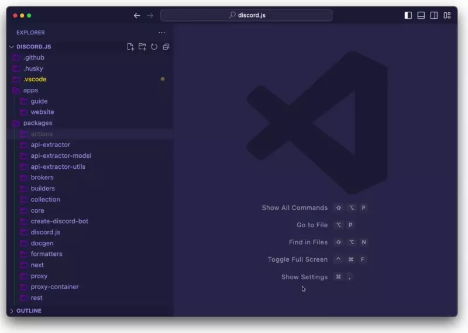

# Monorepo Focus Workspace

Monorepo Focus Workspace is a Visual Studio Code extension that helps manage monorepos by creating a partial tree view to focus on a single or multiple workspaces. Supports NPM, Yarn, Pnpm and Lerna.

## Features

Monorepo Focus Workspace offers some new commands via the command palette. You can see some of them in the video. Below is a detailed description of each command.

Available commands:

- `Monorepo: Pick Workspaces To Focus On`: Manually select multiple workspaces to focus on.
- `Monorepo: Focus On Workspace`: Select a single workspace to focus on
- `Monorepo: Focus On Workspace And Its Prod Dependencies`: Select a single workspace. It will automatically detect the workspaces it depends on and will focus all of them.
- `Monorepo: Focus On Workspace And All Its Dependencies`: Select a single workspace. It will automatically detect the workspaces it depends on, including dev dependencies, and will focus all of them.
- `Monorepo: Toggle Workspace Focus`: If the focus is in some workspaces, it will restore the tree view. Running it again will return the focus to the previously selected workspace(s).
- `Monorepo: Reset Workspace Focus`: Restore the tree view.

## Requirements

It supports Monorepos created with NPM, Yarn, Pnpm, or Lerna.

## Extension Settings

This extension contributes the following settings:

- `monorepoFocusWorkspace.rootPackageJsonRelativePath`: Specifies the relative path to the `package.json` file of the root of the workspaces. Default value: `package.json`.
- `monorepoFocusWorkspace.configurationTarget`: This extension needs to modify the `files.exclude` setting to hide folders. This setting specifies the scope of the setting change. If `workspace`, the setting will be modified in the workspace settings. If `workspace-folder`, the setting will be modified in the workspace folder settings. If `global`, the setting will be modified in the user settings.
- `monorepoFocusWorkspace.enableLogs`: Enable output logs for debugging purposes.

This extension will respect your previously configured `files.exclude` setting. If you want to force the hiding/showing of a path regardless of the selected workspaces, write this setting manually before executing any command.

## Release Notes

### 1.0.0

Initial release of Monorepo Focus Workspace.

## License

This extension is licensed under the [MIT License](LICENSE).
